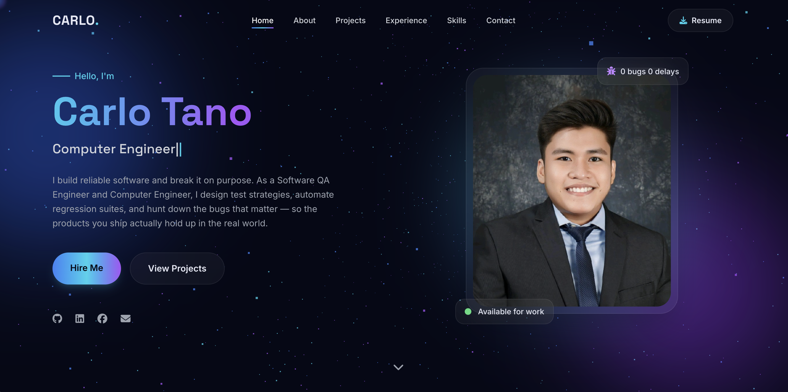

# Carlo Tano Portfolio

A modern, interactive, and responsive personal portfolio website showcasing my skills, projects, and experience as a **Software QA Engineer** and **Computer Engineer**.

## 🌐 Live Demo

 https://yantano.github.io/carlo-tano-portfolio/

## 📸 Preview



## ✨ Features

- Modern and responsive design
- Dark theme with glassmorphism UI
- Smooth scrolling and animations
- Interactive hero section
- Skills showcase
- Project portfolio
- Experience timeline
- Contact section
- Optimized for desktop, tablet, and mobile

## 🛠️ Built With

- HTML5
- Tailwind CSS
- JavaScript (ES6)
- GSAP
- Three.js
- AOS
- Lenis
- Typed.js
- Font Awesome

## 📂 Project Structure

```
portfolio/
├── index.html
├── images/
│   ├── profile_linkedin.jpg
│   └── preview.png
├── documents/
│   ├── resume.pdf
└── README.md
```

## 🚀 Getting Started

1. Clone the repository

```bash
git clone https://github.com/yourusername/carlo-tano-portfolio.git
```

2. Open the project folder.

3. Launch `index.html` in your browser.

No installation or build process is required.

## 👨‍💻 About Me

I'm a Software QA Engineer and Computer Engineering graduate with experience in manual testing, automation testing, bug reporting, and web development. I enjoy building high-quality software and creating modern web experiences.

## 📫 Contact

- Email: tano.carlom@gmail.com
- LinkedIn: https://linkedin.com/in/carlo-tano-7375bb1bb/
- GitHub: https://github.com/YanTano

---

⭐ If you like this project, consider giving it a star.
